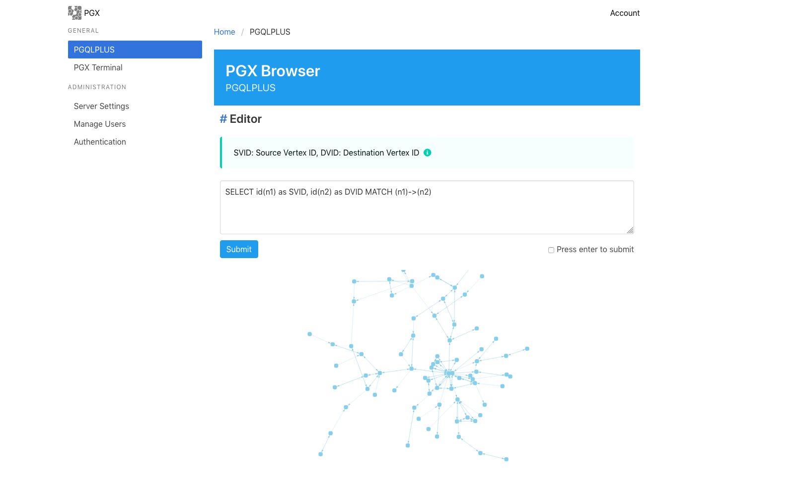

# [WIP] PGX Browser
## Docker

1. Download pgx-2.7.0-server.zip from https://www.oracle.com/technetwork/oracle-labs/parallel-graph-analytix/downloads/downloads-2206142.html

2. move pgx-2.7.0-server.zip ./packages directory

3. Build Docker Image.

```
$ docker build -t pgx-browser .

## Proxy Environment
$ docker build -t pgx-browser . --build-arg http_proxy=$http_proxy --build-arg https_proxy=$http_proxy
```

4. Run Docker Container

```
$ docker run -d -t -p 80:80 pgx-browser
```

5. Browse


